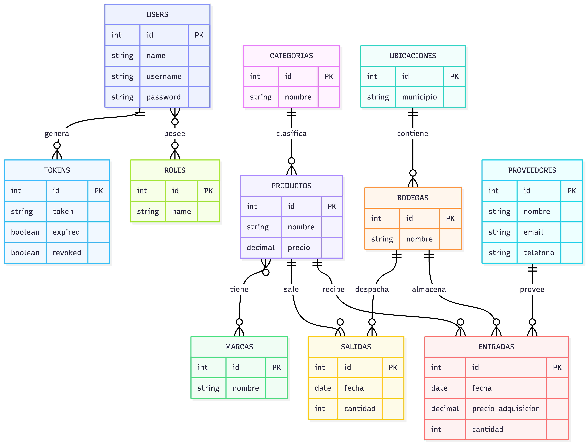
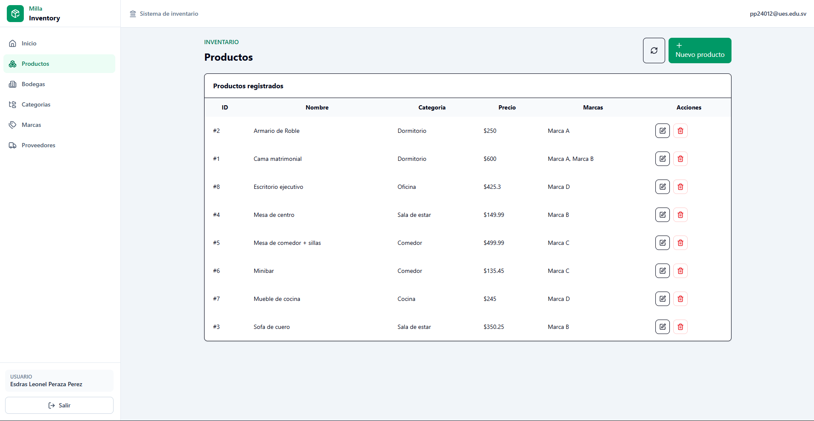
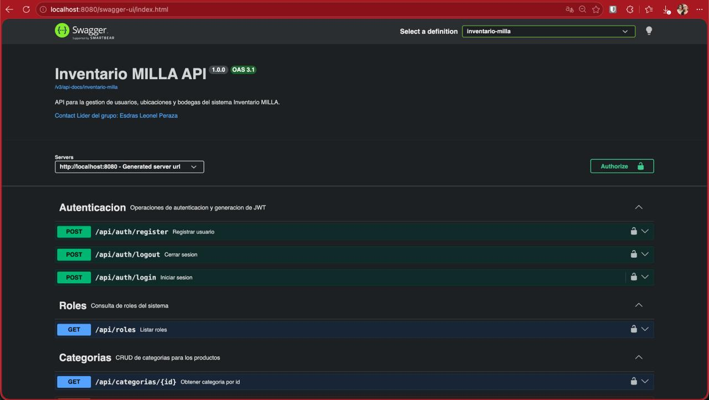
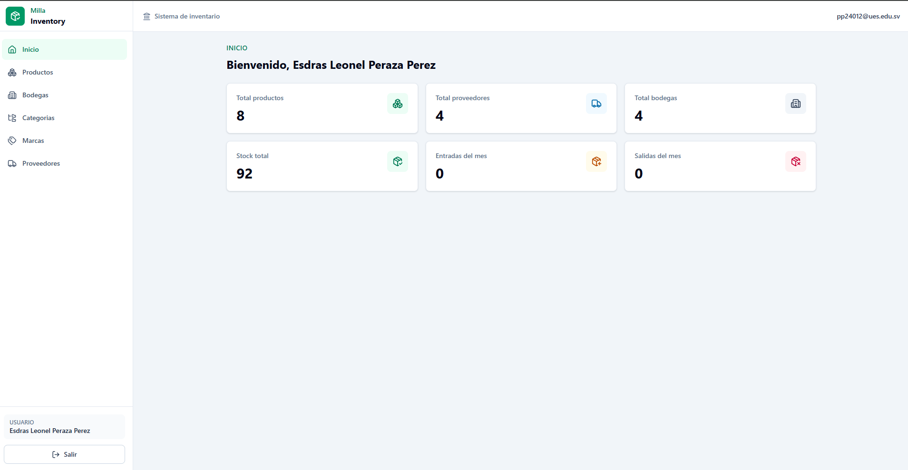
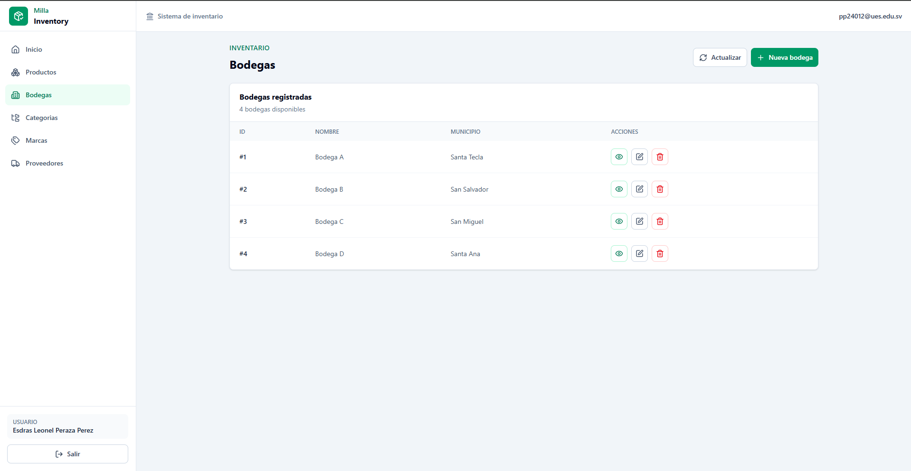
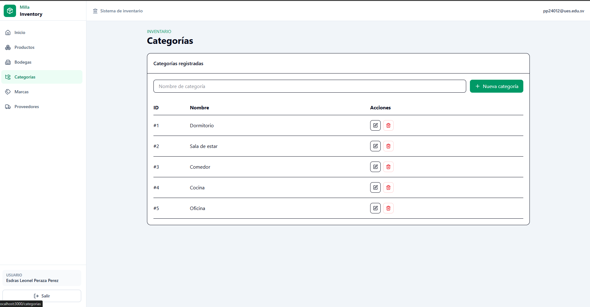
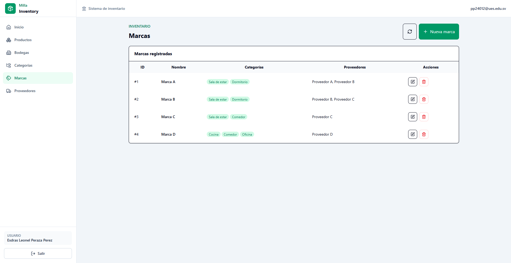
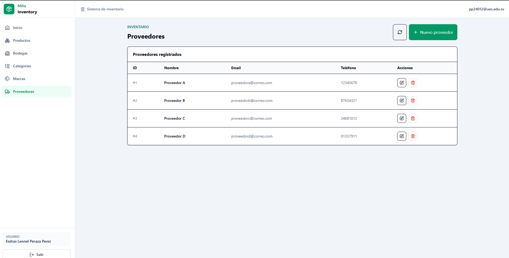

# Inventario MILLA

## Integrantes
- **Omar Farid Parada Paredes** - **PP16018**
- **Esdras Leonel Peraza Pérez** - **PP24012**
- **Rodrigo Antonio Alvarado Pérez** - **AP23050**
- **Ricardo José Guevara Aldana** - **GA24023**

## Descripción del proyecto
La aplicación web Inventario MILLA resuelve la necesidad de la empresa Milla de llevar un control ordenado y confiable del inventario de mobiliario almacenado en sus distintas bodegas. Permite gestionar productos, categorías, marcas, proveedores y usuarios, además de registrar de forma precisa las entradas y salidas de inventario con su respectiva fecha, cantidad, proveedor y precio de adquisición. Con ello, se evita el descontrol de existencias, la pérdida de información y los errores manuales en los movimientos de productos. Asimismo, facilita la consulta de reportes clave para la toma de decisiones, como existencias por bodega e historial de movimientos. Al ser una aplicación responsive y contar con distintos niveles de acceso, también mejora la administración y seguridad del sistema.


## Diagrama Entidad - Relación



## Manual de despligue

Se necesita Docker Desktop con Docker Compose. Desde la raiz del proyecto:

```bash
docker compose up --build
```

La aplicacion queda disponible en `http://localhost:3000`, la API en
`http://localhost:8080` y Swagger en
`http://localhost:8080/swagger-ui.html`.

PostgreSQL ejecuta `database/MillaInventory.sql` automaticamente al crear el
volumen por primera vez. Para borrar la base, volver a crear las tablas y cargar
otra vez los datos iniciales:

```bash
docker compose down -v
docker compose up --build
```
## Evidencia

### Tabla de rutas (Endpoints) del Backend

URL base de la API: `http://localhost:8080`. `login` y `register` son rutas públicas; las demás están sujetas a las reglas de autorización y roles configuradas para la API mediante JWT.

| Módulo | Método | Endpoint | Descripción |
|---|---|---|---|
| Autenticación | `POST` | `/api/auth/login` | Inicia sesión y devuelve un token JWT. |
| Autenticación | `POST` | `/api/auth/register` | Registra un nuevo usuario. |
| Autenticación | `POST` | `/api/auth/logout` | Cierra la sesión y revoca el token actual. |
| Usuarios | `POST` | `/api/users` | Crea un usuario. |
| Usuarios | `GET` | `/api/users` | Lista todos los usuarios. |
| Usuarios | `GET` | `/api/users/{id}` | Obtiene un usuario por ID. |
| Usuarios | `PUT` | `/api/users/{id}` | Actualiza un usuario. |
| Usuarios | `DELETE` | `/api/users/{id}` | Elimina un usuario. |
| Usuarios | `GET` | `/api/users/{id}/roles` | Lista los roles asignados a un usuario. |
| Usuarios | `PUT` | `/api/users/{id}/roles` | Reemplaza los roles de un usuario. |
| Usuarios | `POST` | `/api/users/{id}/roles/{roleId}` | Asigna un rol a un usuario. |
| Usuarios | `DELETE` | `/api/users/{id}/roles/{roleId}` | Retira un rol de un usuario. |
| Roles | `GET` | `/api/roles` | Lista los roles disponibles. |
| Bodegas | `POST` | `/api/bodegas` | Crea una bodega. |
| Bodegas | `GET` | `/api/bodegas` | Lista las bodegas. |
| Bodegas | `GET` | `/api/bodegas/{id}` | Obtiene una bodega por ID. |
| Bodegas | `PUT` | `/api/bodegas/{id}` | Actualiza una bodega. |
| Bodegas | `DELETE` | `/api/bodegas/{id}` | Elimina una bodega. |
| Ubicaciones | `POST` | `/api/ubicaciones` | Crea una ubicación. |
| Ubicaciones | `GET` | `/api/ubicaciones` | Lista las ubicaciones. |
| Ubicaciones | `GET` | `/api/ubicaciones/{id}` | Obtiene una ubicación por ID. |
| Ubicaciones | `PUT` | `/api/ubicaciones/{id}` | Actualiza una ubicación. |
| Ubicaciones | `DELETE` | `/api/ubicaciones/{id}` | Elimina una ubicación. |
| Categorías | `POST` | `/api/categorias` | Crea una categoría. |
| Categorías | `GET` | `/api/categorias` | Lista las categorías. |
| Categorías | `GET` | `/api/categorias/{id}` | Obtiene una categoría por ID. |
| Categorías | `PUT` | `/api/categorias/{id}` | Actualiza una categoría. |
| Categorías | `DELETE` | `/api/categorias/{id}` | Elimina una categoría. |
| Marcas | `POST` | `/api/marcas` | Crea una marca. |
| Marcas | `GET` | `/api/marcas` | Lista las marcas. |
| Marcas | `GET` | `/api/marcas/{id}` | Obtiene una marca por ID. |
| Marcas | `PUT` | `/api/marcas/{id}` | Actualiza una marca. |
| Marcas | `DELETE` | `/api/marcas/{id}` | Elimina una marca. |
| Proveedores | `POST` | `/api/proveedores` | Crea un proveedor. |
| Proveedores | `GET` | `/api/proveedores` | Lista los proveedores. |
| Proveedores | `GET` | `/api/proveedores/{id}` | Obtiene un proveedor por ID. |
| Proveedores | `PUT` | `/api/proveedores/{id}` | Actualiza un proveedor. |
| Proveedores | `DELETE` | `/api/proveedores/{id}` | Elimina un proveedor. |
| Productos | `POST` | `/api/productos` | Crea un producto. |
| Productos | `GET` | `/api/productos` | Lista los productos. |
| Productos | `GET` | `/api/productos/{id}` | Obtiene un producto por ID. |
| Productos | `PUT` | `/api/productos/{id}` | Actualiza un producto. |
| Productos | `DELETE` | `/api/productos/{id}` | Elimina un producto. |
| Stock por bodega | `POST` | `/api/bodegas-productos` | Registra un producto en una bodega. |
| Stock por bodega | `GET` | `/api/bodegas-productos` | Lista el stock registrado. |
| Stock por bodega | `GET` | `/api/bodegas-productos/{id}` | Obtiene un registro de stock por ID. |
| Stock por bodega | `GET` | `/api/bodegas-productos/producto/{productoId}` | Lista el stock de un producto por bodega. |
| Stock por bodega | `GET` | `/api/bodegas-productos/bodega/{bodegaId}` | Lista el stock de una bodega. |
| Stock por bodega | `PUT` | `/api/bodegas-productos/{id}` | Actualiza un registro de stock. |
| Stock por bodega | `DELETE` | `/api/bodegas-productos/{id}` | Elimina un registro de stock. |
| Entradas | `POST` | `/api/entradas` | Registra una entrada de inventario. |
| Entradas | `GET` | `/api/entradas` | Lista las entradas. |
| Entradas | `GET` | `/api/entradas/{id}` | Obtiene una entrada por ID. |
| Entradas | `GET` | `/api/entradas/producto/{productoId}` | Lista entradas por producto. |
| Entradas | `GET` | `/api/entradas/bodega/{bodegaId}` | Lista entradas por bodega. |
| Entradas | `GET` | `/api/entradas/proveedor/{proveedorId}` | Lista entradas por proveedor. |
| Entradas | `PUT` | `/api/entradas/{id}` | Actualiza una entrada. |
| Entradas | `DELETE` | `/api/entradas/{id}` | Elimina una entrada. |
| Salidas | `POST` | `/api/salidas` | Registra una salida de inventario. |
| Salidas | `GET` | `/api/salidas` | Lista las salidas. |
| Salidas | `GET` | `/api/salidas/{id}` | Obtiene una salida por ID. |
| Salidas | `GET` | `/api/salidas/producto/{productoId}` | Lista salidas por producto. |
| Salidas | `GET` | `/api/salidas/bodega/{bodegaId}` | Lista salidas por bodega. |
| Salidas | `PUT` | `/api/salidas/{id}` | Actualiza una salida. |
| Salidas | `DELETE` | `/api/salidas/{id}` | Elimina una salida. |
| Reportes | `GET` | `/api/reportes/resumen` | Obtiene el resumen general del inventario. |
| Reportes | `GET` | `/api/reportes/stock/bodega/{bodegaId}` | Consulta el stock actual de una bodega. |
| Reportes | `GET` | `/api/reportes/stock/producto/{productoId}` | Consulta el stock de un producto en las bodegas. |
| Reportes | `GET` | `/api/reportes/productos-bajo-stock?minimo={cantidad}` | Lista productos con existencias iguales o inferiores al mínimo. |
| Reportes | `GET` | `/api/reportes/movimientos/producto/{productoId}` | Consulta movimientos de un producto. |
| Reportes | `GET` | `/api/reportes/movimientos?fechaInicio={YYYY-MM-DD}&fechaFin={YYYY-MM-DD}` | Consulta movimientos dentro de un rango de fechas. |














